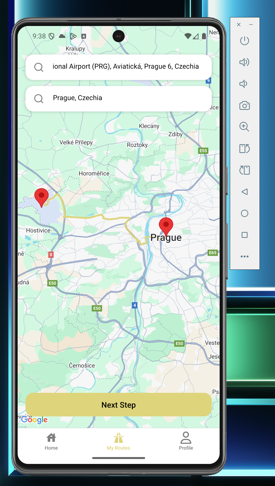
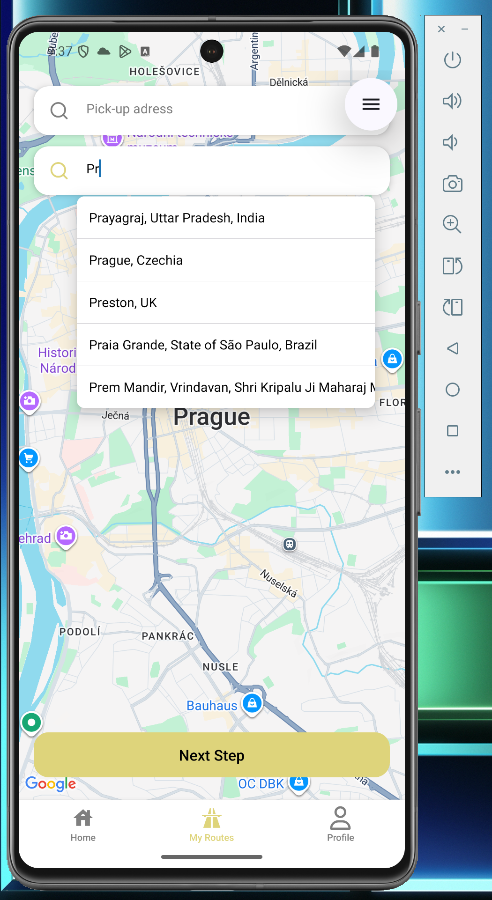
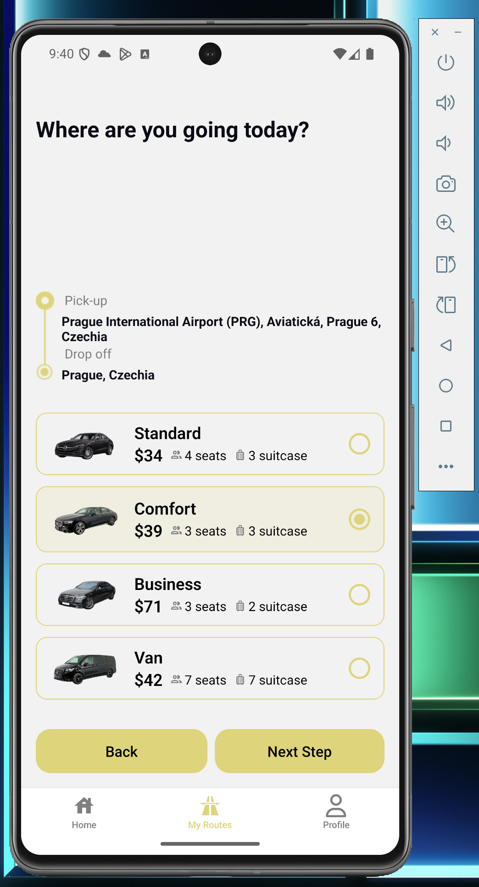

## Що це за застосунок
Мобільний застосунок для трансферів: вибираємо адреси на мапі, будуємо маршрут, бачимо дистанцію/час, рахуємо ціну і вибираємо авто.

## Що я додав/покращив
- Карта з маркерами пікап/дроп, побудова маршруту і автоматичний розрахунок дистанції та ціни.
- Зберігаю адреси і дистанцію в Redux; тему — в Context.
- Анімація вибору авто (LayoutAnimation), оновлені картки авто.
- Плавні переходи між екранами (stack-анімації React Navigation).
- Нові/оновлені компоненти: картки авто, інпут пошуку адреси, екран маршруту.
- Автокомпліт адрес (Google Places) для швидкого вибору пікап/дроп.

## Чому такий стан
- Redux: адреси, дистанція, (опційно) ціна — це глобальні дані, потрібні на кількох екранах.
- Context: тема (світла/темна), бо це простий глобальний прапорець.

## Як працює ціноутворення
- Після побудови маршруту MapViewDirections дає дистанцію в км.
- Дистанція зберігається в Redux і передається в екран вибору авто.
- Картка авто рахує ціну = (посадка + км * тариф)/курс.

## Скріншоти
- 
- 
- 

## Презентація
- Коротка презентація: основна ідея, нові функції (карта/маршрут/ціна, анімація авто), структура стану (Redux для даних, Context для теми), плавні переходи та скріни ключових екранів.
