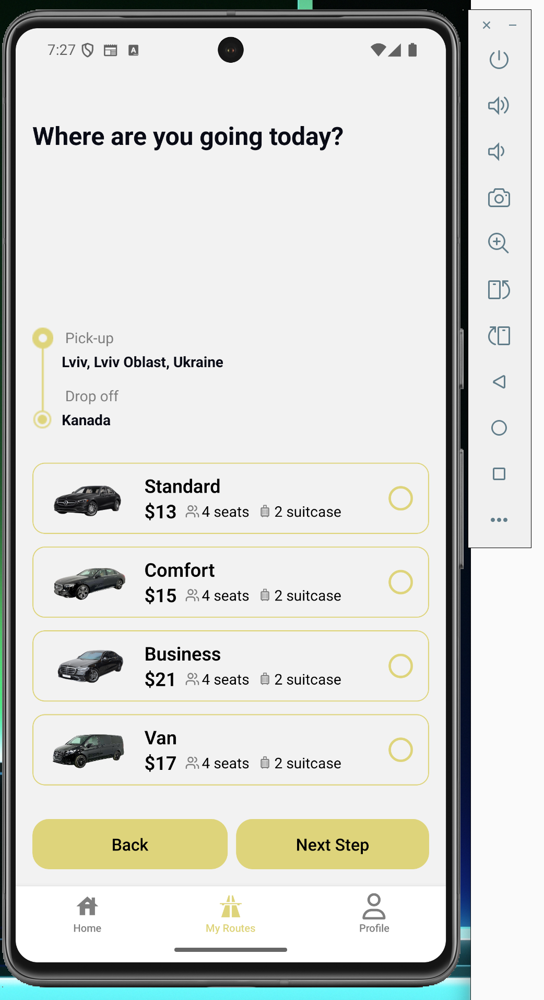
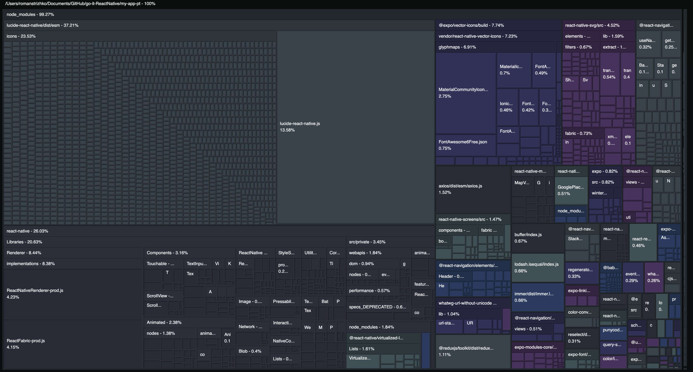
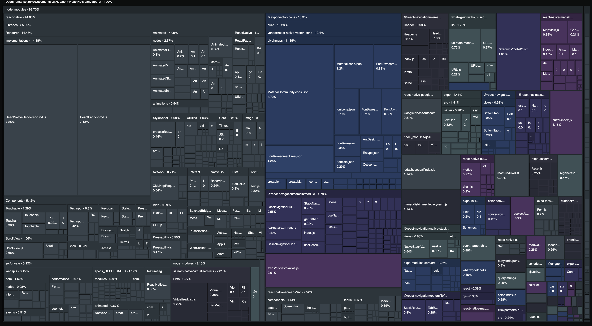

Оптимізації Опис домашнього завдання

- Анімація: LayoutAnimation у виборі авто (ChooseCar + Car) з плавним розкриттям/підсвіткою вибраної картки. (Скріншоти 1 та 2)
- Ререндери: Car обгорнуто в React.memo, price рахується через useMemo, хендлер вибору стабілізовано useCallback.

- Очищення / заміна залежностей: Я проаналізував розмір бандлу за допомогою Expo Atlas і побачив, що бібліотека lucide-react-native займала значну частину JS-бандлу (скріншот Expo-Atlas.png), хоча використовувалась лише для однієї іконки. Я замінив її на іконки з @expo/vector-icons, видалив зайву залежність і підтвердив зменшення бандлу, порівнявши treemap до та після повторної збірки. Результат на скріншоті Expo-Atlas2.png

Скріншоти:
- 
- 
- 
- 
